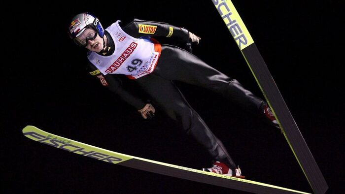
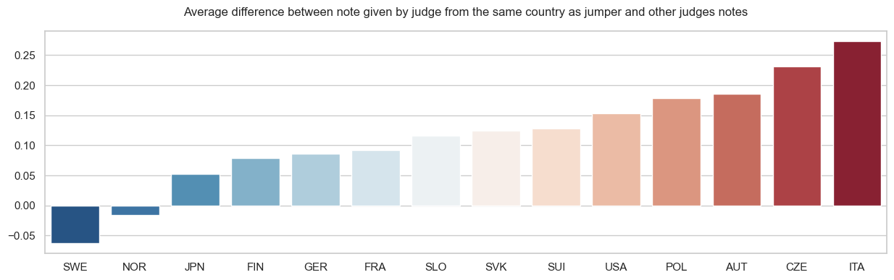
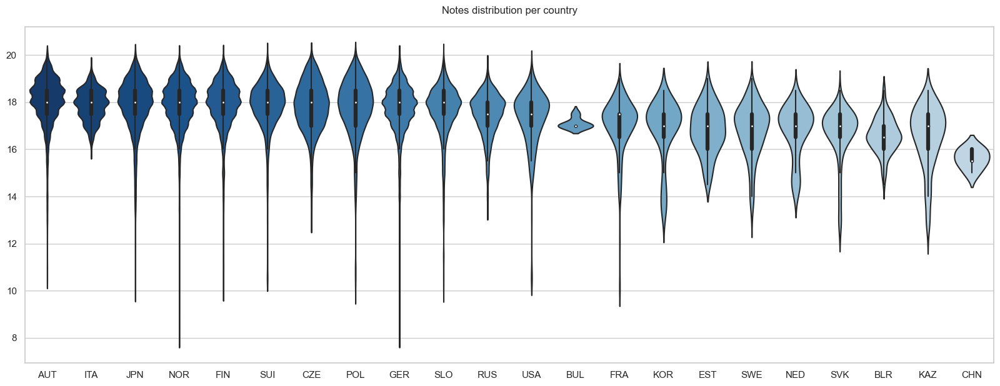

# Ski jumping notes analysis - seasons 2002-2005  

  

  
## Project goal and overview  

I can remember weekends full of nerves when whole families gathered to watch, what emerged to be a sociological phenomenon in early 2000's, a national tradition, 
something that joined truly whole country - the ski jumping competitions. As in this sport not only distance is relevant, but also style it was performed, 
this was always part of deep analysis of whole family to check, whether particular judges didn't harm "our jumpers".  
In this project I would like to gather data from couple of seasons and check, if hypothesis of some of my beloved family experts 
(*GERMAN JUDGE ALWAYS SCORES POLISH JUMPERS LOWER THAN HE SHOULD!!!111*) was right. This is my final project of statistics course in my postgraduate studies 
of Data Analysis and Data Science.  
  
This project consists of two main parts: Data acquisition and its analysis. It was pretty hard to gather all the data since it was stored in .pdf files, which do not
have any structure of keeping the data, so there was plenty of archeological work to extract all scores and data. I have prepared some functions responsible for particular tasks and got the job done - I have presented it in the notebook. All the data is stored in pandas DataFrames and sqlite external database.  
After that I have analysed the results to check my initial hypothesis. Do you also want to know if it was true? Check the notebook!  
  
Below there are some cool charts created during my work:  

  
   
   
  

## Motivation  
  
In this project I have learned some pretty useful skills:  
 - Data scraping - from .pdf files
 - SQLITE - Creating database and operating it from python project
 - SQL and pandas - data manipulation using them
 - Seaborn - creating various charts

## Possible upgrades  
  
Mainly there is much more data to gather, but during time .pdf files changed their format and it complicated data acquisition process. In fact, the main point of the project was to learn some new skills, so I considered this amount sufficient.
